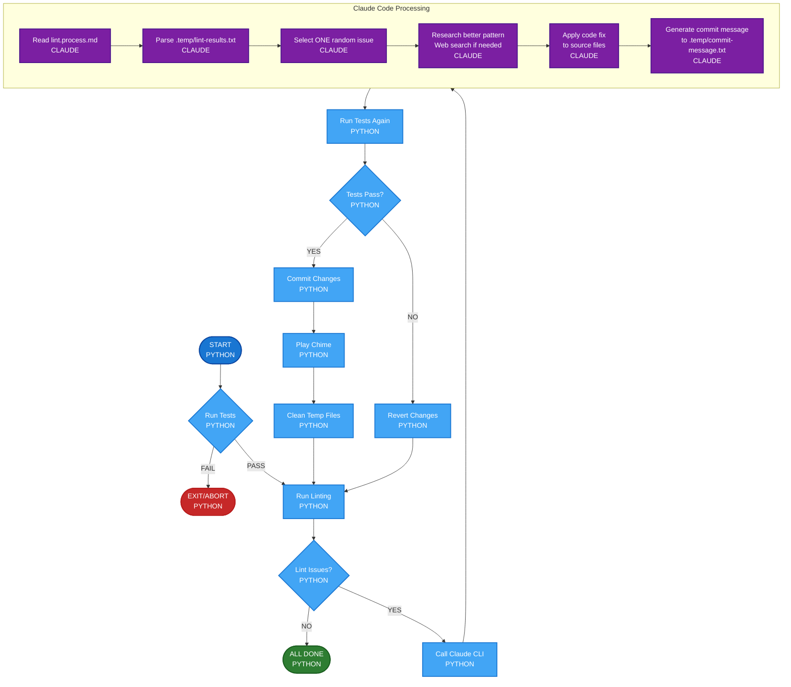

```mermaid
flowchart TD
    Start([START<br/>PYTHON]) --> RunTests1{Run Tests<br/>PYTHON}
    RunTests1 -->|FAIL| Exit([EXIT/ABORT<br/>PYTHON])
    RunTests1 -->|PASS| RunLint["Run Linting<br/>PYTHON"]
    
    RunLint --> HasIssues{Lint Issues?<br/>PYTHON}
    HasIssues -->|NO| Done([ALL DONE<br/>PYTHON])
    HasIssues -->|YES| CallClaude[Call Claude CLI<br/>PYTHON]
    
    CallClaude --> ClaudeContainer
    ClaudeContainer --> RunTests2[Run Tests Again<br/>PYTHON]
    
    subgraph ClaudeContainer["Claude Code Processing"]
        ReadPrompt[Read lint.process.md<br/>CLAUDE]
        ParseLint[Parse .temp/lint-results.txt<br/>CLAUDE]
        SelectIssue[Select ONE random issue<br/>CLAUDE]
        Research[Research better pattern<br/>Web search if needed<br/>CLAUDE]
        ApplyFix[Apply code fix<br/>to source files<br/>CLAUDE]
        WriteCommit[Generate commit message<br/>to .temp/commit-message.txt<br/>CLAUDE]
        
        ReadPrompt --> ParseLint
        ParseLint --> SelectIssue
        SelectIssue --> Research
        Research --> ApplyFix
        ApplyFix --> WriteCommit
    end
    
    RunTests2 --> TestsPass{Tests Pass?<br/>PYTHON}
    
    TestsPass -->|NO| Revert[Revert Changes<br/>PYTHON]
    TestsPass -->|YES| Commit["Commit Changes<br/>PYTHON"]
    
    Commit --> Chime["Play Chime<br/>PYTHON"]
    Chime --> Cleanup[Clean Temp Files<br/>PYTHON]
    
    Cleanup --> RunLint
    Revert --> RunLint
    
    %% Python steps - Blue theme
    style Start fill:#1976d2,stroke:#0d47a1,stroke-width:2px,color:#fff
    style RunTests1 fill:#42a5f5,stroke:#1976d2,stroke-width:2px,color:#fff
    style RunLint fill:#42a5f5,stroke:#1976d2,stroke-width:2px,color:#fff
    style HasIssues fill:#42a5f5,stroke:#1976d2,stroke-width:2px,color:#fff
    style CallClaude fill:#42a5f5,stroke:#1976d2,stroke-width:2px,color:#fff
    style RunTests2 fill:#42a5f5,stroke:#1976d2,stroke-width:2px,color:#fff
    style TestsPass fill:#42a5f5,stroke:#1976d2,stroke-width:2px,color:#fff
    style Commit fill:#42a5f5,stroke:#1976d2,stroke-width:2px,color:#fff
    style Chime fill:#42a5f5,stroke:#1976d2,stroke-width:2px,color:#fff
    style Cleanup fill:#42a5f5,stroke:#1976d2,stroke-width:2px,color:#fff
    style Revert fill:#42a5f5,stroke:#1976d2,stroke-width:2px,color:#fff
    
    %% Claude steps - Purple theme
    style ReadPrompt fill:#7b1fa2,stroke:#4a148c,stroke-width:2px,color:#fff
    style ParseLint fill:#7b1fa2,stroke:#4a148c,stroke-width:2px,color:#fff
    style SelectIssue fill:#7b1fa2,stroke:#4a148c,stroke-width:2px,color:#fff
    style Research fill:#7b1fa2,stroke:#4a148c,stroke-width:2px,color:#fff
    style ApplyFix fill:#7b1fa2,stroke:#4a148c,stroke-width:2px,color:#fff
    style WriteCommit fill:#7b1fa2,stroke:#4a148c,stroke-width:2px,color:#fff
    
    %% End states
    style Done fill:#2e7d32,stroke:#1b5e20,stroke-width:2px,color:#fff
    style Exit fill:#c62828,stroke:#b71c1c,stroke-width:2px,color:#fff
```
